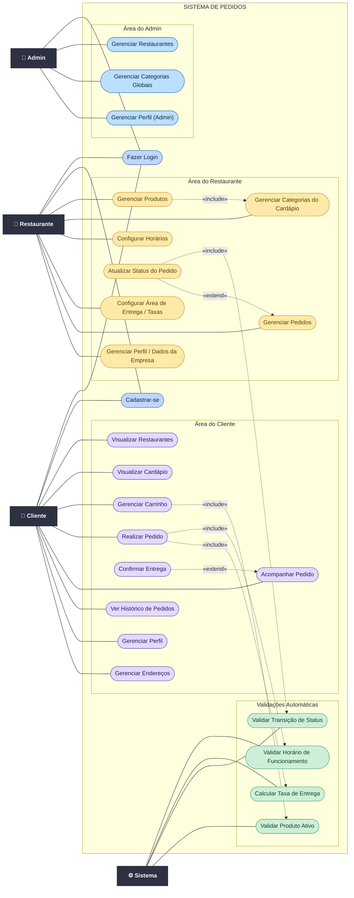

# Diagrama de Casos de Uso — Sistema de Pedidos

**Foco (comportamental):** identificar os atores e as principais funcionalidades que o
software permite, incluindo os relacionamentos `«include»` (obrigatório) e `«extend»`
(opcional/condicional).

**Atores:**
- **Cliente** — consome o sistema: navega, monta carrinho, faz e acompanha pedidos.
- **Restaurante** — gerencia cardápio, logística (horários/área de entrega) e pedidos recebidos.
- **Admin** — modera a plataforma: aprova/bloqueia restaurantes e mantém categorias globais.
- **Sistema** — comportamento automático (validações e cálculos disparados por outros casos).

> **Importar no Lucidchart / Lucidapp:** painel **Diagrama em código → Novo diagrama em
> Mermaid** e colar o bloco abaixo. (Mesmo fluxo dos demais diagramas em `docs/`.)

---

## Legenda

| Elemento | Notação | Significado |
|---|---|---|
| **Ator** | retângulo escuro (`👤` / `⚙️`) | Usuário ou sistema externo que interage com os casos de uso. |
| **Caso de uso** | elipse-estádio `([ ... ])` | Funcionalidade observável que o sistema oferece. |
| **Fronteira do sistema** | caixa `SISTEMA DE PEDIDOS` | Delimita o que pertence ao software. |
| **Associação** | linha sólida `———` | O ator participa do caso de uso. |
| **«include»** | seta tracejada `-.->` | A base **sempre** executa o caso incluído (comportamento obrigatório). |
| **«extend»** | seta tracejada `-.->` | O caso estende a base **apenas sob condição** (comportamento opcional). |

**Cores por ator:** roxo = Cliente · amarelo = Restaurante · azul = Admin ·
verde = Sistema · azul-claro = casos de acesso compartilhados (Login/Cadastro).

---

## Notas de modelagem (rastreabilidade com o código)

### Relacionamentos «include» (obrigatórios)
- **Realizar Pedido → Validar Horário de Funcionamento** — `PedidoService.criarPedido()`
  chama `isRestauranteAberto()`, que rejeita o pedido fora do horário cadastrado.
- **Realizar Pedido → Calcular Taxa de Entrega** — o pedido sempre define a taxa
  (`setTaxaEntrega()`) e consolida o total (`calcularTotal()`).
- **Gerenciar Carrinho → Validar Produto Ativo** — `CarrinhoService` não permite adicionar
  produto inativo ao carrinho.
- **Atualizar Status do Pedido → Validar Transição de Status** — `PedidoService.atualizarStatus()`
  chama `validarTransicao()`, que impõe a máquina de estados do `StatusPedido`.
- **Gerenciar Produtos → Gerenciar Categorias do Cardápio** — não é possível cadastrar um
  produto sem uma categoria de cardápio previamente existente.

### Relacionamentos «extend» (condicionais)
- **Confirmar Entrega ⇢ Acompanhar Pedido** — a confirmação por código só é possível quando o
  pedido está em `SAIU_PARA_ENTREGA` (`PedidoService.confirmarEntrega()`).
- **Atualizar Status do Pedido ⇢ Gerenciar Pedidos** — ao gerenciar os pedidos recebidos, o
  restaurante **pode** avançar o status de um pedido ativo (ação opcional do fluxo).

### Observações
- **Login/Cadastro** aparecem como casos compartilhados associados diretamente aos atores
  (não como `«include»` em cada caso), para refletir o controle de acesso sem poluir o diagrama.
  O login do **Restaurante** ainda é condicionado ao status `ATIVO` (aprovação do Admin).
- O ator **Sistema** concentra os comportamentos automáticos (validações e cálculos) que são
  disparados por outros casos via `«include»`, e não diretamente por um usuário humano.
- O diagrama foi modelado como um grafo (`graph LR`) do Mermaid (que não possui tipo nativo
  de *use case*), emulando a notação UML — mesma técnica usada no diagrama de componentes
  deste repositório.
  Após importar no Lucidchart, é possível substituir os nós de ator pela forma nativa de
  "ator" (boneco-palito), se desejar maior fidelidade visual.
